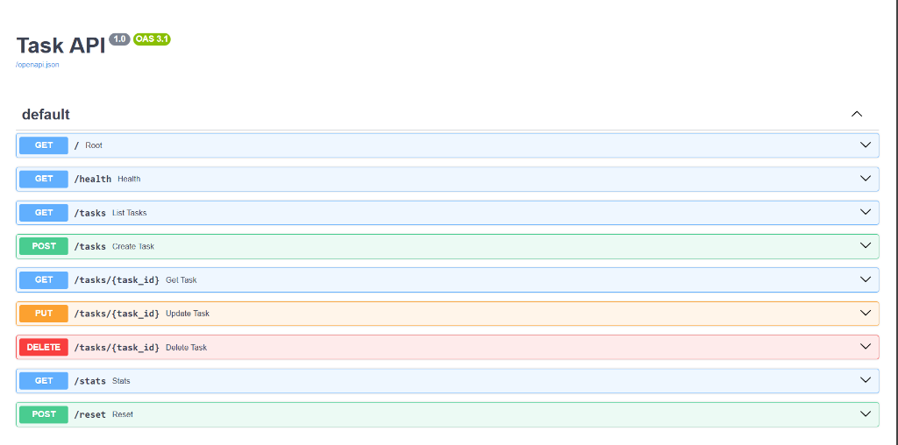

# Task API

My submission for FlyRank's Backend Track, Week 2 (Assignment A1) — a small CRUD API for a
to-do list, built with FastAPI.

## What this is

Five endpoints, full CRUD on a list of tasks: create one, read them, update them, delete them.
No database — everything lives in a plain Python list in memory, which means restarting the
server wipes it back to the three seed tasks. More on that at the bottom.

## Running it

```
python -m venv venv
venv\Scripts\pip install -r requirements.txt
venv\Scripts\python -m uvicorn main:app --port 8000
```

Once it's up, http://localhost:8000/docs gets you Swagger UI where you can click through every
endpoint without touching curl. I mostly used curl anyway out of habit, but Swagger's genuinely
nice for a quick sanity check.

## Endpoints

| Method | Path          | What it does                              | Success | Errors                        |
|--------|---------------|--------------------------------------------|---------|--------------------------------|
| GET    | `/`           | API info                                   | 200     | —                              |
| GET    | `/health`     | Health check                               | 200     | —                              |
| GET    | `/tasks`      | List tasks (`?done=` and `?search=` filter them) | 200 | —                        |
| GET    | `/tasks/{id}` | Get one task                               | 200     | 404 if it doesn't exist        |
| POST   | `/tasks`      | Create a task, body `{"title": "..."}`     | 201     | 400 if title's missing/blank   |
| PUT    | `/tasks/{id}` | Update `title` and/or `done`               | 200     | 400 empty body, 404 unknown id |
| DELETE | `/tasks/{id}` | Delete a task                              | 204     | 404 if it doesn't exist        |
| GET    | `/stats`      | `{"total", "done", "open"}` counts         | 200     | —                              |
| POST   | `/reset`      | Puts the 3 seed tasks back                 | 200     | —                              |

(`/stats` and `/reset` weren't required, just seemed like fun extras once the core five were
working.)

## One example

```
$ curl -i -X POST http://localhost:8000/tasks -H "Content-Type: application/json" -d '{"title":"Buy milk"}'
HTTP/1.1 201 Created
content-type: application/json

{"id":4,"title":"Buy milk","done":false}
```

## Swagger UI



## AI vs me (Stage 7)

For this stage I wrote a spec from memory (see [`ai-version/prompt.txt`](ai-version/prompt.txt))
and had an AI build the same API from it, kept completely separate in `ai-version/` — my actual
submission above is untouched. Then I ran both and threw the same requests at each.

**Where the AI's version was actually better:**
Storing tasks in a `dict` keyed by id instead of a list turned out to be a smarter call than what
I did — `tasks[task_id]` is O(1), while my version does a linear scan through a list every time
(`find_task()`). A dict makes sense here since ids are already unique ints; I'd only need a list
if task order had to be independent of id. It's also just less code — no seed/reset helper, no
custom exception handlers — mostly because I never asked for those in the prompt.

**Where it got things wrong (or just didn't do them):**
1. **Blank titles get through.** `POST /tasks` with `{"title": ""}` still returns `201` and
   creates a task with an empty title. `Task.title: str` in the AI version only checks it's a
   string, not that it's non-empty — no validator on it. Mine explicitly strips and rejects blank
   titles.
2. **Missing title returns 422, not 400.** Post `{}` and you get FastAPI's default
   `422 Unprocessable Content` with a raw Pydantic error array, instead of the `400` +
   `{"error": "..."}` shape the assignment wants. This is a pretty easy trap to fall into — 422 is
   what FastAPI does automatically the moment you don't override it, and it *looks* like proper
   validation happened even though the status code is wrong for what was asked.
3. **Empty `PUT` body just silently succeeds.** Send `{}` to `PUT /tasks/1` and it comes back
   `200 OK` with the task completely unchanged — no error at all. I never told the prompt to
   reject an empty update, so the AI never had a reason to think about that case.

**Gaps in my own prompt — things the AI had to decide on its own:**
- I never nailed down what the error body should actually look like, so it just kept FastAPI's
  default `{"detail": ...}` shape, which isn't even consistent between a 404 (`detail` is a
  string) and a 422 (`detail` is a list of objects).
- I didn't say what should happen if a `PUT` has neither field set, so it defaulted to "just
  succeed and change nothing" — not unreasonable, but not what the checkpoint expects either.
- I never mentioned the query filters, `/stats`, or `/reset` since those were optional extras to
  begin with, so it correctly didn't invent them.

**Rematch:** I rewrote the prompt to explicitly say *"treat blank/whitespace titles the same as a
missing title, and always return 400 with a plain `{"error": "<message>"}` body for both — never
FastAPI's default 422."* That one sentence would fix issues #1, #2, and the error-shape mismatch.
Which is basically the whole point of this stage — the model wasn't the bottleneck, my spec was.

## The mortality experiment

Create a few tasks, restart the server, and they're gone — back to the original 3. That's
because everything lives in a Python list in memory rather than anything written to disk. It's
not a bug, just the tradeoff of skipping a database for this assignment (that's apparently next
week's problem).
